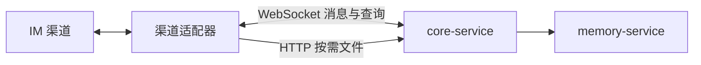

# AICHAN

AICHAN 是一个通过 Adapter Protocol 2.0 连接 IM 渠道的对话 Agent 系统。Adapter 是渠道消息与文件的权威来源；Core 统一处理连接、会话上下文、模型推理、按需文件感知、历史消息查询和渠道能力调用。

## 架构



核心 workspace 只包含 `core-service` 与 `memory-service`。Adapter 必须实现 Protocol 2.0 WebSocket、当前会话消息分页查询和 HTTP 文件读取；其他渠道专属工具可通过 capability RPC 声明。

## 启动

复制 `.env.example` 为 `.env`，填写 Core、感知模型、记忆模型、观测和 Adapter Token，然后运行：

```bash
docker compose up -d --build
```

详细架构、配置和协议见 [docs/README.md](docs/README.md)。
