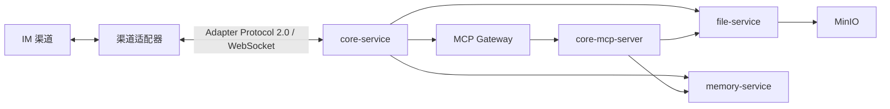

# AICHAN

AICHAN 是一个通过 Adapter Protocol 2.0 连接 IM 渠道的对话 Agent 系统。渠道接入、过滤、消息转换和投递由独立适配器负责；Core 统一处理连接、会话编排、上下文、模型推理与工具调用。

## 架构



核心 workspace 包含 `core-service`、`core-mcp-server`、`file-service` 与 `memory-service`。渠道适配器是独立部署单元，只依赖 `protocol/adapter/v2` 中的语言无关契约。

## 启动

复制 `.env.example` 为 `.env`，复制 `.env.mcp.example` 为 `.env.mcp`，填写模型、观测、适配器令牌和 MCP 工具密钥，然后运行：

```bash
docker compose up -d --build
```

详细架构、配置和协议见 [docs/README.md](docs/README.md)。
