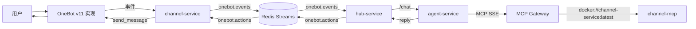
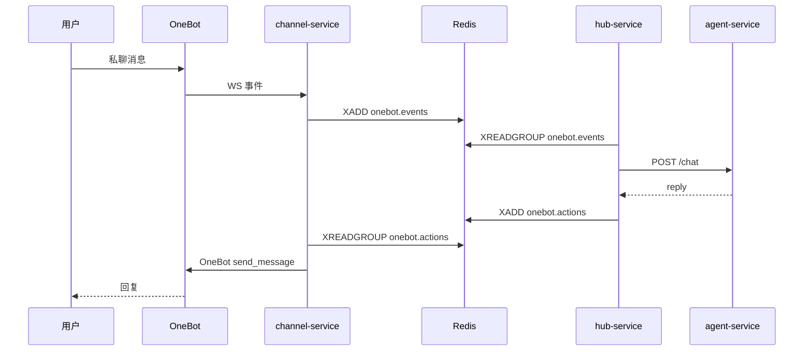

# AICHAN

一个把 OneBot 事件接入、会话编排、LLM 推理和消息回写串成闭环的三服务机器人系统。

## 架构图


## 职责矩阵
| 服务 | 职责 | 接口 | 依赖 | 故障影响 |
|---|---|---|---|---|
| `channel-service` | OneBot 接入、事件标准化、动作执行、MCP 历史查询 | `WS /onebot/v11/ws`、`GET /api/v1/*`、`channel-mcp` | OneBot、Redis、`mcp-gateway` | 事件无法入流，动作无法回写 |
| `hub-service` | 事件消费、会话防抖、调用 `agent-service`、写回动作流 | `GET /healthz` | Redis、`agent-service` | 回复链路中断，`onebot.events` 堆积 |
| `agent-service` | 会话上下文、LLM 推理、MCP 工具调用 | `POST /chat` | LLM API、MCP SSE | 无法生成回复正文 |

## 核心链路


## 快速开始
1. 安装依赖：
```bash
uv sync --all-packages
```

2. 启动基础设施：
```bash
docker compose up -d redis mcp-gateway
```

3. 启动业务服务：
```bash
uv run --package channel-service channel-service
uv run --package hub-service hub-service
uv run --package agent-service agent-service
```

## 配置
- 每个服务只读取各自目录下的 `config.yml`
- 不使用 `.env` 别名层
- 改地址、端口、超时、队列名，只改对应服务配置文件

## 技术栈
- Python 3.12
- FastAPI
- Redis Streams
- MCP Python SDK
- OpenAI 兼容 API
- OneBot v11 兼容实现
- Docker / Docker Compose

## 文档导航
1. [docs/README.md](docs/README.md)
2. [docs/aichan.md](docs/aichan.md)
3. [docs/channel-service.md](docs/channel-service.md)
4. [docs/hub-service.md](docs/hub-service.md)
5. [docs/agent-service.md](docs/agent-service.md)

## 已知风险
- 会话状态主要在内存中，重启会丢上下文。
- 群聊事件当前被直接过滤，功能边界较窄。
- Redis / LLM / OneBot 任一层抖动都会放大成端到端延迟。
