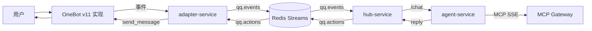

# AICHAN

AICHAN 是一个把 OneBot 事件接入、会话编排、LLM 推理和消息回写串成闭环的机器人系统。

## 系统总览


## 快速开始（推荐：Docker）
1. 启动全套服务（含 NapCat）：
```bash
docker compose up -d --build
```
2. 打开 NapCat WebUI 扫码登录 QQ：
```text
http://localhost:6099/webui
```
WebUI 口令以 `napcat/config/webui.json` 中的 `token` 字段为准。  
注意：若配置为默认弱口令 `napcat` 或空字符串，NapCat 启动时会自动改写为随机口令。
登录二维码同步到 `napcat/cache/qrcode.png`，可在宿主机直接打开扫码。
3. 验证 OneBot 连接是否成功：
```bash
docker compose logs -f napcat adapter-service
```
看到 `adapter-service` 日志里的 `OneBot WS 已连接` 即表示接入成功。

## 配置原则
- 每个服务只读取各自目录下的 `config.yml`。
- 不使用 `.env` 别名层。
- 地址、端口、超时、队列名等参数只改对应模块配置文件。

## 常用命令
```bash
# 停止并移除容器
docker compose down

# 查看全部服务日志
docker compose logs -f
```

## 文档导航
1. [docs/README.md](docs/README.md)
2. [docs/aichan.md](docs/aichan.md)
3. [docs/adapter-service.md](docs/adapter-service.md)
4. [docs/hub-service.md](docs/hub-service.md)
5. [docs/agent-service.md](docs/agent-service.md)

## 已知限制
- 会话状态主要在内存中，重启会丢上下文。
- 消息过滤默认仅处理私聊，是否放行群聊由配置控制。
- Redis / LLM / OneBot 任一层抖动都会放大为端到端延迟。

