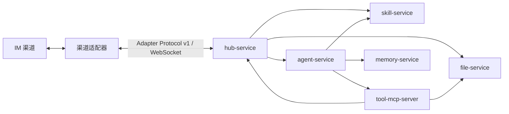

# AICHAN

AICHAN 是一个以标准适配器协议连接 IM 渠道的对话 Agent 系统。核心服务保持渠道无关：具体的 IM 接入、过滤、消息转换和投递都交给可插拔的渠道适配器，核心只处理会话编排、模型推理、工具调用、文件与长期记忆。

## 架构



核心由六个自包含的 FastAPI 服务组成，通过 Docker Compose 编排：

| 服务 | 职责 |
|---|---|
| agent-service | LLM 推理与会话上下文 |
| hub-service | 适配器注册、会话编排、能力路由 |
| tool-mcp-server | 通用适配器、文件、视觉和记忆工具 |
| file-service | 媒体对象存储（MinIO） |
| memory-service | 长期记忆 |
| skill-service | runtime skill 注册与解析 |

渠道适配器不是核心 workspace 成员，而是通过 Adapter Protocol v1 接入的独立服务，可独立部署甚至独立成仓库。仓库自带 QQ/NapCat 适配器实现，见 [adapters/aichan-qq-adapter/](adapters/aichan-qq-adapter/)。

## 部署

核心服务与渠道适配器分属独立的 Compose，共享一张由核心 Compose 创建、适配器以 `external` 引用的网络（`aichan-adapter-network`）。**必须先启动核心服务**，否则适配器会因网络不存在而无法创建。

第一步，复制 `.env.example` 为 `.env` 并填入 agent/memory 的模型名与 API Key，以及适配器令牌表 `HUB__ADAPTER_TOKENS`。然后在仓库根启动核心服务（同时创建共享网络）：

```bash
docker compose up -d --build
```

第二步，按各适配器自身文档启动其 Compose。适配器经共享网络接入 hub，并以令牌完成注册鉴权。

## 文档

完整架构、数据流、配置、接口与开发说明统一收录在 [docs/README.md](docs/README.md)。
