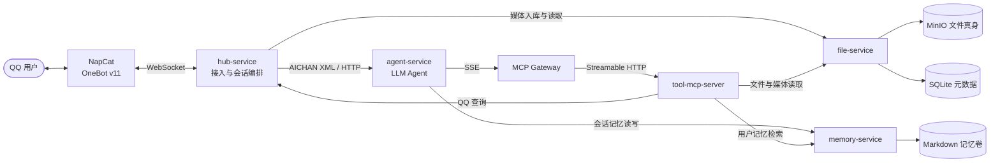

# AICHAN

基于 OneBot v11、LLM 与 MCP 的 QQ 私聊/群聊助理。项目将 QQ 接入、会话编排、模型推理、长期记忆、文件存储和工具能力拆分为独立服务。

## 架构



核心边界：`hub-service` 独占 NapCat WebSocket，`file-service` 独占 MinIO，`memory-service` 负责持久化记忆，`agent-service` 只处理 AICHAN XML、模型上下文与工具循环。

## 快速开始

```bash
# 启动
docker compose up -d --build

# 扫码登录 QQ
# 打开 http://localhost:6099/webui，口令见 napcat/config/webui.json

# 查看主链路日志
docker compose logs -f hub-service agent-service memory-service file-service tool-mcp-server
```

首次启动前，从 `.env.example` 准备本地 `.env`，至少填写 agent、memory 使用的模型和 API Key。宿主机常用入口为 NapCat WebUI `6099`、agent `18000`、hub `18020`、file `18040`、memory `18050`、MCP Gateway `19000`、MinIO Console `19001`。

## 配置

每个服务读取自己的 `config.yml`，Docker Compose 再用根目录 `.env` 注入模型、密钥、MinIO 和 vision 覆盖项。仓库中的密钥字段是占位值，首次启动前需要在本地填写真实值。

| 服务 | 配置 |
|------|------|
| agent-service | `agent-service/config.yml` |
| memory-service | `memory-service/config.yml` |
| file-service | `file-service/config.yml` / MinIO 凭证环境变量 |
| hub-service | `hub-service/config.yml` |
| tool-mcp-server | `tool-mcp-server/config.yml` / `VISION__...` |
| MinIO | `.env` 中的 `MINIO_ROOT_USER` / `MINIO_ROOT_PASSWORD` |
| NapCat | `napcat/config/*.json` |

## 文档

完整索引见 [docs/README.md](docs/README.md)。建议先阅读 [系统总览](docs/aichan.md) 和 [消息协议](docs/message-protocol.md)，再按职责进入各服务文档。
