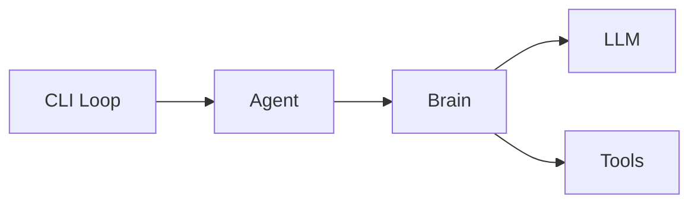

# 2号文档：AIChan 架构文档

## 2.1 当前仓库结构

```text
AIChan/
├─ main.py
├─ pyproject.toml
├─ uv.lock
├─ docs/
│  ├─ 0.boundary.md
│  ├─ 1.system-design.md
│  └─ 2.project-structure.md
└─ packages/
   ├─ core/
   ├─ plugins/
   ├─ nexus/
   ├─ brain/
   └─ memory/
```

## 2.2 分层职责
- `core`：基础设施层，提供配置、日志、接口契约与共享实体。
- `plugins`：能力层，统一承载可被 `Agent` 调用的外设能力（可扩展输入/输出通道）。
- `nexus`：中枢层，当前作为异步队列编排能力预留。
- `brain`：推理层，作为单消费者执行 LLM 推理与非通道工具调用。
- `memory`：记忆层，承接短期/长期记忆扩展。

## 2.3 核心运行拓扑



## 2.4 主链路
1. 用户在 `main.py` 的交互式 CLI 中输入消息。
2. `main.py` 发送 `AgentSignal(channel=...)`，调用 `Agent.process_signal(...)` 处理本轮输入。
3. `Agent` 组装上下文并把消息交给 `Brain`。
4. `Brain` 在 LangGraph 图中执行推理，并按需调用非通道工具。
5. 最终文本回复返回到 `main.py` 并输出到终端。

## 2.5 关键模块落点
- `main.py`
  - 组装 `plugins` 与 `brain`，构建 `Agent`。
  - 提供交互式 CLI 输入/输出循环。
  - 负责打印模型回复和请求耗时。
- `packages/nexus/src/nexus/hub.py`
  - 预留中央队列与心跳能力，可用于后续异步编排扩展。
- `packages/plugins/src/plugins/channels/cli.py`
  - 预留 CLI 通道插件，可扩展成独立输入/输出通道。
- `packages/plugins/src/plugins/registry.py`
  - 统一注册插件并汇总插件实例。
- `packages/brain/src/brain/brain.py`
  - 维护推理图与工具调用执行流程。

## 2.6 运行约束
- 当前默认交互入口是 `main.py` CLI，输入直接交给 `Agent`。
- `Brain` 是唯一 LLM 调用入口。
- 插件不做推理，仅暴露工具能力或通道能力。
- 运行时优先保证顺序一致性和可观测性。
