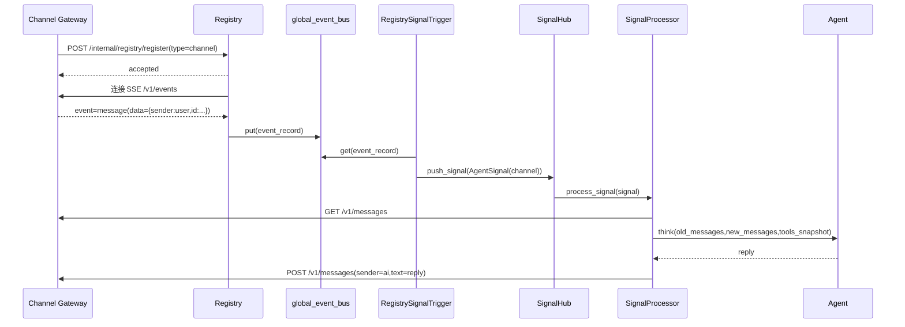

# 3号文档：消息闭环

## 3.1 闭环目标

保证从网关新消息到大脑回复的完整闭环：

1. 消息可被可靠感知；
2. 信号只触发一次；
3. 推理流程可观测并可重试。

## 3.2 时序流程

## 3.3 去重规则

`RegistrySignalTrigger` 维护每个通道的最新 `user` `message_id`：

- 新事件 `message_id` 小于等于已记录值：忽略；
- 大于已记录值：更新并触发信号。

这样可规避 SSE 重连时的重复事件回放。

## 3.4 失败恢复

1. Registry 感知链路
   - OpenAPI 拉取失败：3 秒重试；
   - SSE 断线：3 秒重连。
2. 网关注册
   - 网关启动后注册失败：3 秒重试，直到成功。
3. 推理处理
   - `SignalHub` 捕获处理异常后继续消费后续信号，不中断主循环。

