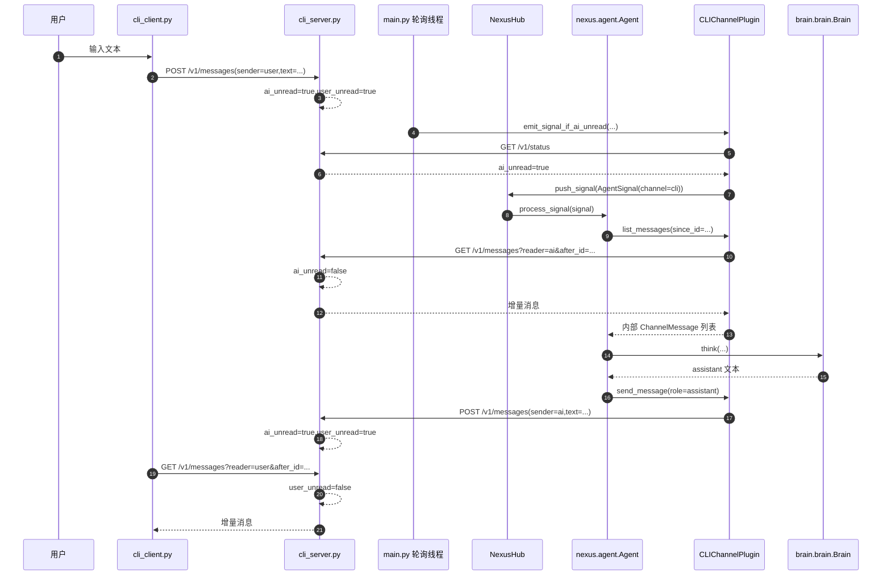

# 3号文档：AIChan 消息收发闭环文档

## 3.1 文档目标
本文仅描述当前实现下的消息闭环和状态推进，不讨论历史迁移。

关注范围：
- `cli_server` 的双对象未读状态机制。
- AIChan 如何每秒轮询未读状态并触发信号。
- `Agent` 如何拉取消息、推理并回写。

## 3.2 闭环总览



## 3.3 cli_server 双对象状态模型
`cli_server` 只维护两个通信对象：`ai`、`user`。

状态字段：
- `ai_unread: bool`
- `user_unread: bool`

状态规则：
1. 任一方发送消息（`POST /v1/messages`）后：
- `ai_unread = true`
- `user_unread = true`

2. 某方获取消息（`GET /v1/messages?reader=...`）后：
- 对应 `reader` 的未读状态置为 `false`

3. 查询状态（`GET /v1/status`）不改变状态。

## 3.4 外部服务 API
- `GET /health`
- `GET /v1/status`
- `GET /v1/messages?reader=ai|user&after_id={id}`
- `POST /v1/messages`

写入请求体：

```json
{
  "sender": "ai|user",
  "text": "..."
}
```

返回消息体：

```json
{
  "id": 1,
  "sender": "user",
  "text": "hello",
  "created_at": "2026-03-27T12:00:00+00:00"
}
```

## 3.5 AIChan 轮询触发机制
`main.py` 启动一个后台轮询线程（1 秒间隔）：
1. 调用 `CLIChannelPlugin.emit_signal_if_ai_unread(...)`。
2. plugin 内部先查询 `ai_unread`，若为 `true` 则通过回调触发 `AgentSignal(channel=cli)` 入队。

说明：
- 发送信号职责在 AIChan/plugin 侧；
- `cli_server` 不负责信号推送，保持外部服务解耦。

## 3.6 plugin 协议统一
`CLIChannelPlugin` 将外部协议映射为内部统一消息：

- 外部 `sender=user` -> 内部 `role=user`
- 外部 `sender=ai` -> 内部 `role=assistant`

回写时：
- 内部 `role=assistant/system` -> 外部 `sender=ai`
- 内部 `role=user` -> 外部 `sender=user`

## 3.7 Agent 处理链路
`Agent.process_signal()`：
1. 根据 channel 名定位 `CLIChannelPlugin`。
2. `list_messages(since_id=last_processed_id)` 拉取增量消息。
3. 过滤 `role=user` 的新消息并逐条推理。
4. `send_message(role=assistant, content=reply)` 回写回复。
5. 更新 `_last_processed_user_message_id[channel]`。

## 3.8 客户端接收链路
`cli_client.py` 每轮输入前和发送后短轮询：
1. `GET /v1/messages?reader=user&after_id=last_seen_id`
2. 只显示 `sender=ai` 的消息
3. 更新 `last_seen_id`

## 3.9 异常边界
- 空文本发送：服务端 `400`。
- 外部服务不可达：plugin/client 抛 `CLIMessageServiceError`。
- 轮询异常：记录日志，下一轮继续，不中断主服务。
- 推理异常：`NexusHub` 记录异常，后续信号继续消费。
