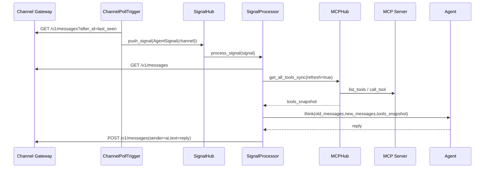

# 3号文档：消息闭环

## 3.1 闭环目标

保证从网关新消息到大脑回复的完整闭环：

1. 消息可被可靠感知；
2. 信号只触发一次；
3. 推理流程可观测并可重试。

## 3.2 时序流程

## 3.3 去重规则

`ChannelPollTrigger` 维护每个通道的最新 `user` `message_id`：

- 新事件 `message_id` 小于等于已记录值：忽略；
- 大于已记录值：更新并触发信号。

这样可规避轮询窗口内的重复触发。

## 3.4 失败恢复

1. 通道轮询链路
   - 通道请求失败：记录告警并在下一轮继续重试。
2. MCPHub 工具链路
   - MCP Server 连接失败：按 required 策略处理（强依赖失败即中断启动）；
   - `tools/list` 失败：可选服务告警并跳过，强依赖服务抛错。
3. 推理处理
   - `SignalHub` 捕获处理异常后继续消费后续信号，不中断主循环。
