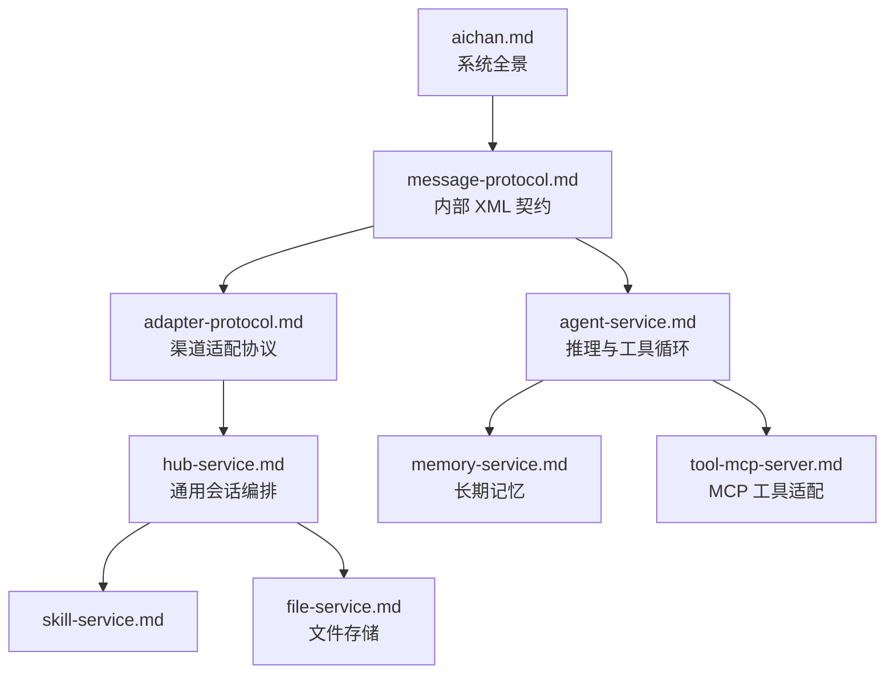

# 文档索引

项目文档分为系统设计、服务说明和适配协议三层。核心服务不感知具体 IM 渠道，渠道实现由各自的适配器仓库维护。

## 推荐阅读顺序

1. [aichan.md](aichan.md) — 服务拓扑、端到端数据流、部署与故障边界
2. [message-protocol.md](message-protocol.md) — hub 与 agent 之间的 AICHAN XML 契约
3. [adapter-protocol.md](adapter-protocol.md) — 适配器注册、事件、ACK 与能力 RPC
4. [hub-service.md](hub-service.md) — 渠道无关的连接与会话编排
5. [skill-service.md](skill-service.md) — runtime skill 注册与解析
6. [agent-service.md](agent-service.md) — 会话上下文、LLM 循环、MCP 与记忆调度
7. [memory-service.md](memory-service.md) — session 无损日志与 user 内化记忆
8. [file-service.md](file-service.md) — SHA-256 去重、MinIO 真身与 SQLite 影子元数据
9. [tool-mcp-server.md](tool-mcp-server.md) — 适配器、文件、媒体理解和用户记忆工具

## 按问题查找

| 想了解的问题 | 文档 |
|---|---|
| 适配器如何注册、上报事件并接收回复 | [适配协议](adapter-protocol.md) |
| 消息怎样变成模型输入 | [消息协议](message-protocol.md#输入) |
| 连续消息如何合并、运行中消息如何追入 | [hub-service](hub-service.md#会话) |
| Agent 怎样调用工具并收敛最终回复 | [agent-service](agent-service.md) |
| memory-service 是否直接提供 MCP 工具 | [memory-service](memory-service.md#1-模块定位) |
| 文件为何只使用 SHA-256 object_key | [file-service](file-service.md#3-存储模型) |
| 当前有哪些 MCP 工具 | [tool-mcp-server](tool-mcp-server.md) |

渠道适配器（如 QQ/NapCat）作为独立仓库维护，其文档随适配器仓库分发；核心侧只定义 [adapter-protocol.md](adapter-protocol.md) 这一渠道无关契约。
