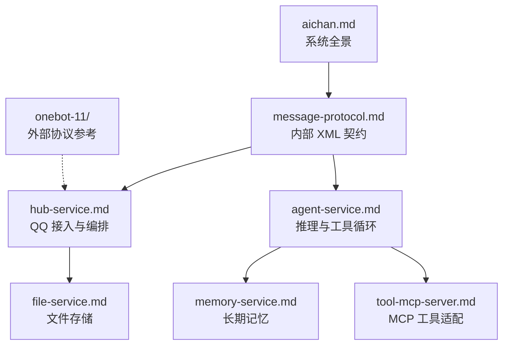

# 文档索引

项目文档分为系统设计、服务说明和外部协议参考三层。

## 推荐阅读顺序

1. [aichan.md](aichan.md) — 服务拓扑、端到端数据流、部署与故障边界
2. [message-protocol.md](message-protocol.md) — hub 与 agent 之间的 AICHAN XML 契约
3. [hub-service.md](hub-service.md) — NapCat 接入、白名单、防抖和出站动作
4. [agent-service.md](agent-service.md) — 会话上下文、LLM 循环、MCP 与记忆调度
5. [memory-service.md](memory-service.md) — session 无损日志与 user 内化记忆
6. [file-service.md](file-service.md) — SHA-256 去重、MinIO 真身与 SQLite 影子元数据
7. [tool-mcp-server.md](tool-mcp-server.md) — QQ、文件、媒体理解和用户记忆 MCP 工具

## 按问题查找

| 想了解的问题 | 文档 |
|---|---|
| 一条 QQ 消息如何完成收发 | [系统总览](aichan.md#3-消息数据流) |
| OneBot 消息怎样变成模型输入 | [消息协议](message-protocol.md#2-输入格式) |
| 连续消息如何合并、运行中消息如何追入 | [hub-service](hub-service.md#4-防抖调度流程) |
| Agent 怎样调用工具并收敛最终回复 | [agent-service](agent-service.md#33-agent-执行循环) |
| memory-service 是否直接提供 MCP 工具 | [memory-service](memory-service.md#1-模块定位) |
| 文件为何只使用 SHA-256 object_key | [file-service](file-service.md#3-存储模型) |
| 当前有哪些 MCP 工具 | [tool-mcp-server](tool-mcp-server.md#3-mcp-工具) |

`onebot-11/` 保存外部 OneBot v11 协议参考，不代表 AICHAN 内部服务契约；项目内部以本目录的服务文档和 `message-protocol.md` 为准。
