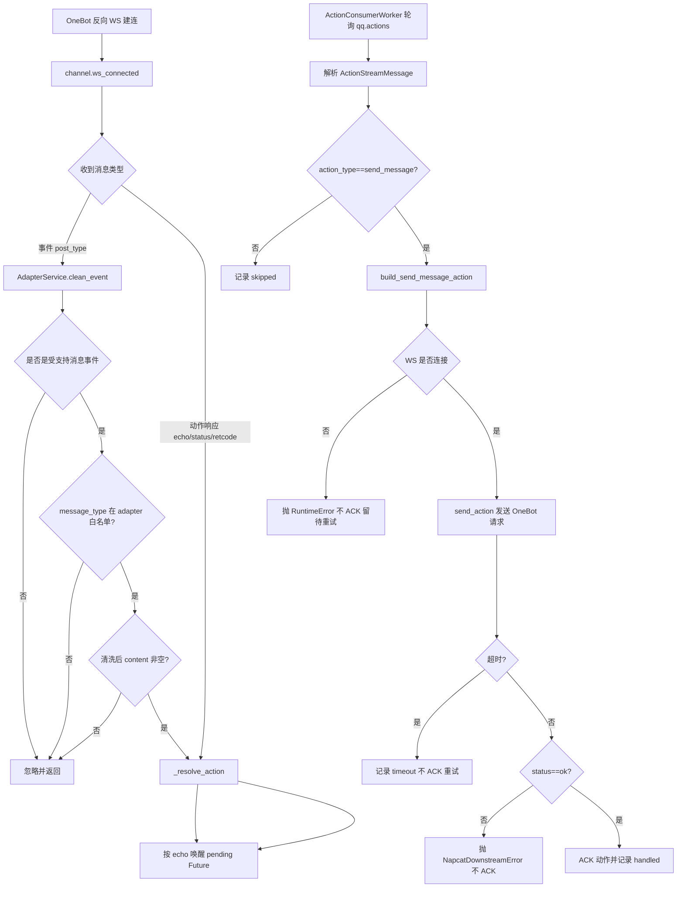

# adapter-service

## 1. 模块一句话定位
`adapter-service` 是 QQ 协议适配层：连接 OneBot v11 反向 WebSocket，把入站消息事件规范化并按配置做业务过滤后写入 `qq.events`，并消费 `qq.actions` 执行发送动作。  
不负责会话编排与 agent 调度（这些由 `hub-service` 负责）。

## 2. 接口契约
### 2.1 对外提供（HTTP/WS）
- `GET /healthz`
  - 响应：`{"status":"ok"}`

- `WS /onebot/v11/ws`
  - 入站消息分类：
    - 事件消息：包含 `post_type`
    - 动作响应：包含 `echo/status/retcode`
  - 连接状态：`NapcatConnectionState` 全局仅保存当前单连接引用。

- `GET /api/v1/user/{user_id}/info`
  - 入参：`user_id`（如 `qq_123`）
  - 行为：转换为 OneBot `get_stranger_info` 并通过当前 WS 发送
  - 失败语义：
    - WS 未连接：`503`
    - 参数非法：`422`
    - OneBot 超时：`504`
  - 成功响应：`{"ok": true, "data": <onebot_response_dict>}`

- `GET /api/v1/message/history`
  - Query：
    - `session_id`（最小长度 1，必须是 `group_*` 或 `private_*`）
    - `limit`（`1..50`，默认 `20`）
    - `before_message_id`（可选，`>=1`）
  - 行为：
    - `group_*` -> `get_group_msg_history`
    - `private_*` -> `get_friend_msg_history`
    - 统一归一化输出为 `session_id/messages/next_before_message_id`
  - 失败语义：同上（`503/422/504`）
  - 成功响应：`{"ok": true, "data": {"session_id": "...", "messages": [...], "next_before_message_id": 123}}`

### 2.2 对外提供（MCP，`adapter-mcp` 进程）
- 工具名：`qq_get_message_history`
- 参数：
  - `session_id: str`（前缀必须 `group_` 或 `private_`）
  - `limit: int=20`（`1..50`）
  - `before_message_id: int | None`（若提供必须正整数）
- 返回：JSON 字符串（`ensure_ascii=False`），内容是 `adapter-service /api/v1/message/history` 的 `data` 字段。
- 错误语义：
  - 参数边界错误：`ValueError`
  - HTTP 请求失败或返回非法结构：`RuntimeError`

### 2.3 对外消费（Redis Stream）
- 读取流：`redis.actions_stream`（默认 `qq.actions`）
- 读取方式：`XREADGROUP`（group=`redis.actions_group`，consumer=`redis.actions_consumer`）
- 消息结构（`ActionStreamMessage`）：
  - `action_id`、`session_id`、`action_type`、`payload`、`created_at`
  - `payload.content` 为必填且非空字符串

### 2.4 对外产出（Redis Stream）
- 写入流：`redis.events_stream`（默认 `qq.events`）
- 消息结构（`EventStreamMessage`）：
  - `event_id`、`session_id`、`user_id`、`content`、`source`、`message_type`、`raw_event`、`created_at`
- 产出规则：
  - 只接收 OneBot 消息事件并做结构化清洗。
  - 按 `adapter.allowed_message_types` 过滤 `message_type`。
  - 清洗后空文本事件会在适配层直接丢弃。

### 2.5 异常码说明
- 未定义独立业务错误码体系，错误通过 HTTP 状态码与日志表达。

## 3. 核心数据模型
### 3.1 标准化事件（`FilteredEventPayload` / `EventStreamMessage`）
- `session_id`：会话路由键（`group_` / `private_`）
- `user_id`：抽象用户标识（`qq_` 前缀）
- `content`：清洗后的纯文本（先 `extract_plain_text`，再去 CQ 码和首尾空白）
- `raw_event`：原始事件保留，供下游诊断和再推理

### 3.2 动作消息（`ActionStreamMessage`）
- `action_type`：当前只识别 `send_message`
- `payload.content`：最终回发给 QQ 上游实现的消息体

### 3.3 连接与动作等待态
- `NapcatConnectionState._websocket`：当前有效连接引用（单实例）
- `NapcatWsGateway._pending_actions`：`echo -> Future` 映射，用于请求-响应配对

### 3.4 ID 映射规则
- `group_id <-> group_{group_id}`
- `user_id <-> private_{user_id}`
- `user_id <-> qq_{user_id}`

## 4. 核心业务流程

## 5. 配置项与运行依赖
### 5.1 配置文件
- 路径：`adapter-service/config.yml`
- 规则：仅 YAML；Pydantic 严格校验；禁止未知字段。

### 5.2 配置项（当前代码）
- `server.host`、`server.port`
- `adapter.onebot_ws_action_timeout_seconds`、`adapter.allowed_message_types`
- `redis.host`、`redis.port`、`redis.db`、`redis.password`
- `redis.events_stream`、`redis.actions_stream`
- `redis.actions_group`、`redis.actions_consumer`、`redis.actions_block_ms`
- `mcp.base_url`、`mcp.timeout_seconds`

### 5.3 运行依赖
- OneBot v11 反向 WebSocket 客户端（例如 NapCat 等兼容实现）
- Redis（Stream + Consumer Group）
- FastAPI / websockets / redis asyncio / nonebot-adapter-onebot / httpx / mcp

## 6. 非功能性设计
### 6.1 错误处理
- 动作消费者采用最小边界：
  - 不可恢复输入错误（解析失败、非法 session）：ACK 丢弃
  - 运行期故障（WS 断连、下游失败、超时）：不 ACK，保留 PEL 后续重试
- MCP 客户端把下游错误详情折叠为可读字符串，便于 agent 决策。

### 6.2 日志
- 前缀统一：`adapter_service.*`
- 关键链路日志：启动/停止、WS 连接状态、动作消费结果、OneBot 调用耗时与超时。
- 框架日志降噪，突出业务事件。

### 6.3 性能关键点
- 事件与动作流均使用 Redis Stream 批量消费（每批 10）。
- `echo->Future` 映射支持同一连接内并发 Action 请求-响应匹配。
- 单连接状态简化了路由复杂度，但限制横向扩展形态。

## 7. 架构边界与集成点
### 7.1 所在层级
- 渠道接入层（Channel Adapter Layer）。

### 7.2 强依赖
- OneBot 反向 WS：无连接则无法执行历史查询和发送动作。
- Redis：无 Redis 无法向 hub 投递事件，也无法消费动作。

### 7.3 弱依赖
- `adapter-mcp` 是上层 agent 增强能力，不影响基础事件转发链路。

### 7.4 故障影响
- `adapter-service` 不可用：QQ 事件无法入流，`qq.actions` 无人执行。
- WS 断连：`/api/v1/*` 查询失败且动作处理转入重试。
- `adapter-mcp` 不可用：agent 的历史消息检索能力下降，但主消息流仍可运行。

## 8. 设计权衡与已知不足
- 业务过滤在 adapter 收口，能减少下游压力；但若未来做多渠道统一策略，可能需要把策略再次上收到 hub。
- `NapcatConnectionState` 仅持有单 WS 引用：实现简单，但多连接/多实例下缺少路由与一致性策略。
- 动作失败重试依赖 PEL，未设置死信队列与最大重试次数：故障消息可能长期回放。
- `send_action` 只按 `echo` 匹配响应，未对返回体做更细语义校验（除了 `status`）。
- HTTP `healthz` 不检查 Redis/WS/OneBot 真实可用性，探针成功不等于链路可用。
