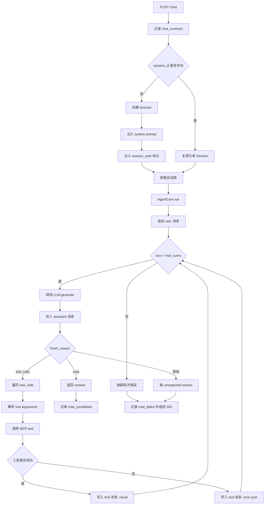

# agent-service

## 1. 模块一句话定位
`agent-service` 是对话推理执行层：维护会话上下文、驱动 LLM 多轮推理与 MCP 工具调用，并通过 HTTP `/chat` 输出最终回复。  
不负责消息接入与投递（由 `adapter-service`/`hub-service` 处理）。

## 2. 接口契约
### 2.1 对外提供（HTTP）
- `GET /healthz`
  - 响应：`{"status":"ok"}`

- `POST /chat`
  - 请求体（`ChatRequest`）：
    - `session_id: str`（最小长度 1）
    - `user_message: str`（最小长度 1）
  - 响应体（`ChatResponse`）：
    - `reply: str`
  - 处理语义：
    - 同一 `session_id` 复用同一个 `Session` 对象（会话历史持久于进程内内存）。
    - 同一 `session_id` 请求串行执行（会话级锁），不同会话可并行。
  - 失败语义：
    - 任意未捕获异常 -> `500`，`detail` 为异常字符串。

### 2.2 对外消费（LLM API）
- 客户端：`openai.OpenAI`
- 请求参数（`chat.completions.create`）：
  - `model`
  - `messages`（会话消息历史）
  - `temperature`
  - `tool_choice="auto"`
  - `tools`（来自 MCP 注册结果）
- 响应关键字段：
  - `content`
  - `tool_calls`
  - `finish_reason`（`stop/length/tool_calls/content_filter/function_call`）
- 错误语义：
  - `APIStatusError`：记录状态码与响应体后抛 `RuntimeError`
  - 其他异常：记录异常后抛 `RuntimeError`

### 2.3 对外消费（MCP SSE）
- 启动阶段：调用 `list_tools` 拉取远端工具列表并本地固化。
- 运行阶段：按工具名调用 `call_tool`，返回 JSON 字符串写回 `tool` 消息。
- 鉴权：如配置了 `mcp_auth_token`，通过 `Authorization: Bearer <token>` 发送。

### 2.4 异常码说明
- 模块未定义独立业务错误码体系；对外 HTTP 失败统一为 `500`。

## 3. 核心数据模型
### 3.1 会话模型（`Session`）
- `_session_id`：会话标识。
- `_messages`：符合 OpenAI Chat 格式的消息列表。
- 写入规则：
  - `assistant` 角色可附 `tool_calls`
  - `tool` 角色可附 `tool_call_id`

### 3.2 LLM 响应模型（`LlmResponse`）
- `content: str`
- `tool_calls: List[ToolCall]`
- `finish_reason`：控制状态机分支的关键字段

### 3.3 MCP 工具绑定（`McpToolBinding`）
- `remote_name`
- `description`
- `input_schema`（会做 schema 清洗，移除不支持键如 `propertyNames`）

### 3.4 会话上下文注册表（`session_contexts`）
- 结构：`dict[session_id, (Session, Lock)]`
- 语义：
  - 注册表锁只负责“首次创建”
  - 会话锁负责单会话串行

## 4. 核心业务流程

## 5. 配置项与运行依赖
### 5.1 配置文件
- 路径：`agent-service/config.yml`
- 加载方式：仅 YAML；Pydantic 严格校验（`extra="forbid"`）。

### 5.2 配置项（当前代码）
- `server.host`、`server.port`
- `agent.model`
- `agent.max_turns`
- `agent.temperature`
- `agent.openai_api_key`
- `agent.openai_base_url`
- `agent.mcp_sse_url`
- `agent.mcp_auth_token`

### 5.3 运行依赖
- OpenAI 兼容 Chat Completions API
- MCP SSE Gateway（工具列表与工具调用）
- FastAPI / uvicorn / anyio / mcp-python SDK

## 6. 非功能性设计
### 6.1 错误处理
- 路由层在 `/chat` 做统一异常边界，保证失败时返回 `500` 并记录会话级异常日志。
- 工具调用失败不会中断回合，而是转成 `tool` 消息中的错误 JSON，让模型决定降级策略。

### 6.2 日志
- 统一前缀：`agent_service.*`
- 覆盖关键事件：应用启动、请求接收、会话绑定、回合响应、工具调用、请求失败。
- 框架日志静默，减少噪声。

### 6.3 性能关键点
- 会话内串行锁保障上下文一致性，避免并发写历史导致污染。
- 不同会话并行执行，吞吐受限于外部 LLM/MCP 调用与 Python 线程池模型。
- 工具列表在启动时缓存，避免每轮请求重复拉取。

## 7. 架构边界与集成点
### 7.1 所在层级
- 智能体执行层（Agent Execution Layer）。

### 7.2 强依赖
- LLM API：不可用时无法生成回复。
- MCP Gateway：启动阶段注册失败会导致服务初始化失败。

### 7.3 弱依赖
- `healthz` 仅提供进程存活信息，不覆盖下游可用性。

### 7.4 故障影响
- `agent-service` 不可用：`hub-service` 调用 `/chat` 失败，主链路无法产出回复。
- MCP 工具异常：可能降级为无工具回答，或回合内持续错误后触发失败。
- 单进程重启：会话内存丢失，多轮上下文断档。

## 8. 设计权衡与已知不足
- 会话状态仅保存在进程内内存：实现简单，但不支持跨实例共享，也没有重启恢复。
- `/chat` 失败统一 `500`：调用方简单，但可观测维度不足（无错误分类码）。
- `max_turns` 到达即失败：防无限循环有效，但复杂工具链任务可能被硬截断。
- MCP 工具 schema 只做最小清洗，跨提供方兼容性依然依赖上游 schema 质量。
- 当前 `config.yml` 方式要求明文敏感配置，需结合部署侧密钥管理策略降低泄露风险。

