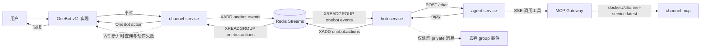

# aichan

## 1. 模块一句话定位
AICHAN 是一个由 `channel-service`、`hub-service`、`agent-service` 组成的三层消息机器人系统，目标是把 OneBot 事件转成可编排、可推理、可回写的闭环。  
本文档只描述系统级边界、服务组合方式和主链路，不展开单个服务的实现细节。

## 2. 接口契约
### 2.1 系统没有单一入口
系统层本身不提供统一 API，真实契约分散在三个服务、Redis Streams 和 MCP Gateway 中。

### 2.2 服务级接口
- `channel-service`
  - `GET /healthz`
  - `WS /onebot/v11/ws`
  - `GET /api/v1/user/{user_id}/info`
  - `GET /api/v1/message/history`
  - `channel-mcp` 工具：`onebot_get_message_history`
- `hub-service`
  - `GET /healthz`
- `agent-service`
  - `GET /healthz`
  - `POST /chat`

### 2.3 消息与工具通道
- 事件流：`onebot.events`
- 动作流：`onebot.actions`
- MCP SSE：`http://mcp-gateway:9000/sse`

### 2.4 故障语义
- `channel-service` 断开：消息无法进入系统，也无法回写。
- `hub-service` 失败：事件无法被编排为回复。
- `agent-service` 失败：无法生成回复正文。
- `Redis` 失败：事件和动作都无法在服务间流转。

## 3. 核心数据模型
- `session_id`：跨服务的会话主键，格式为 `private_*` 或 `group_*`。
- `user_id`：抽象用户标识，格式为 `onebot_*`。
- `event_id`：进入系统的事件标识。
- `action_id`：待发送动作标识。
- `message_type`：`private` / `group`，决定是否进入 hub 调度。
- `tool_calls`：agent 侧的工具调用指令集合。

## 4. 核心业务流程

```mermaid
flowchart LR
    U[用户] --> O[OneBot v11 实现]
    O -->|事件| C[channel-service]
    C -->|XADD onebot.events| R[(Redis Streams)]
    R -->|XREADGROUP onebot.events| H[hub-service]
    H -->|POST /chat| A[agent-service]
    A -->|SSE 调用工具| M[MCP Gateway]
    M -->|docker://channel-service:latest| T[channel-mcp]
    A -->|reply| H
    H -->|XADD onebot.actions| R
    R -->|XREADGROUP onebot.actions| C
    C -->|OneBot action| O
    O -->|回复| U

    C -.->|WS 断开时查询与动作失败| O
    H -.->|仅处理 private 消息| X[丢弃 group 事件]
```

## 5. 配置项与运行依赖
### 5.1 运行编排
- `docker-compose.yml` 负责组合 `redis`、`mcp-gateway`、`agent-service`、`channel-service`、`hub-service`。
- `uv workspace` 负责本地开发时的多包依赖管理。

### 5.2 外部依赖
- Redis 7
- OneBot v11 兼容实现
- OpenAI 兼容模型接口
- MCP Gateway
- Docker socket（供 `mcp-gateway` 拉起 `docker://channel-service:latest` 工具容器）

### 5.3 配置形态
- 三个业务服务都只读取各自目录下的 `config.yml`。
- 运行时没有环境变量别名层，配置语义全部由 YAML 决定。

## 6. 非功能性设计
- 系统采用“接入层 - 编排层 - 推理层”拆分，减少服务之间的强耦合。
- 事件与动作使用 Redis Stream 解耦，默认语义接近至少一次投递。
- 会话状态主要在 `hub-service` 和 `agent-service` 的进程内内存中，简单但不利于多副本共享。
- 日志按服务名前缀收口，便于按链路排障。

## 7. 架构边界与集成点
### 7.1 强依赖
- `channel-service` 依赖 OneBot 连接与 Redis。
- `hub-service` 依赖 Redis 与 `agent-service`。
- `agent-service` 依赖 LLM API 与 MCP SSE。

### 7.2 弱依赖
- `mcp-gateway` 是 `agent-service` 的工具扩展层，不直接影响基础消息收发。
- `healthz` 只表示进程活着，不代表下游连通。

### 7.3 故障影响链
- OneBot 异常会先放大到 `channel-service`，再波及全链路。
- Redis 异常会同时阻断事件入流与回复出流。
- LLM 异常会让系统退化为“只能接入，不能生成回复”。

## 8. 设计权衡与已知不足
- 当前以私聊提醒为主，群聊在适配层被直接过滤，功能边界清晰但场景受限。
- `onebot.events` / `onebot.actions` 已对齐协议中立命名，但历史测试数据与外部观测脚本可能仍残留旧名字。
- `hub-service` 与 `agent-service` 都依赖进程内会话状态，多副本和重启恢复能力弱。
- `channel-mcp` 与业务 HTTP 服务共用代码仓库，部署上通过镜像入口和 `command` 覆盖分离。
