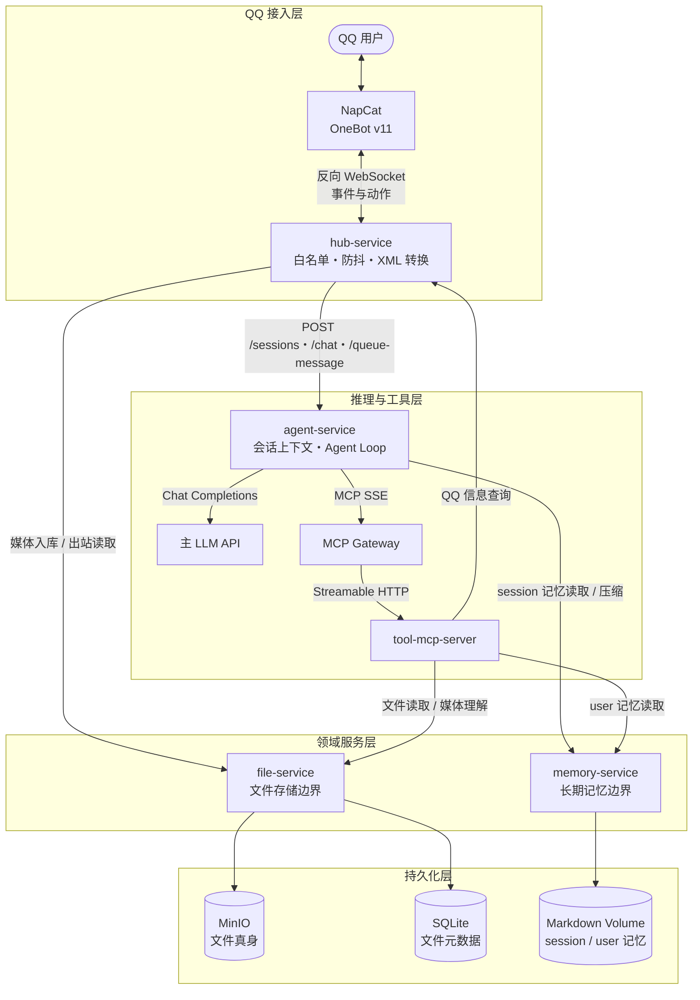
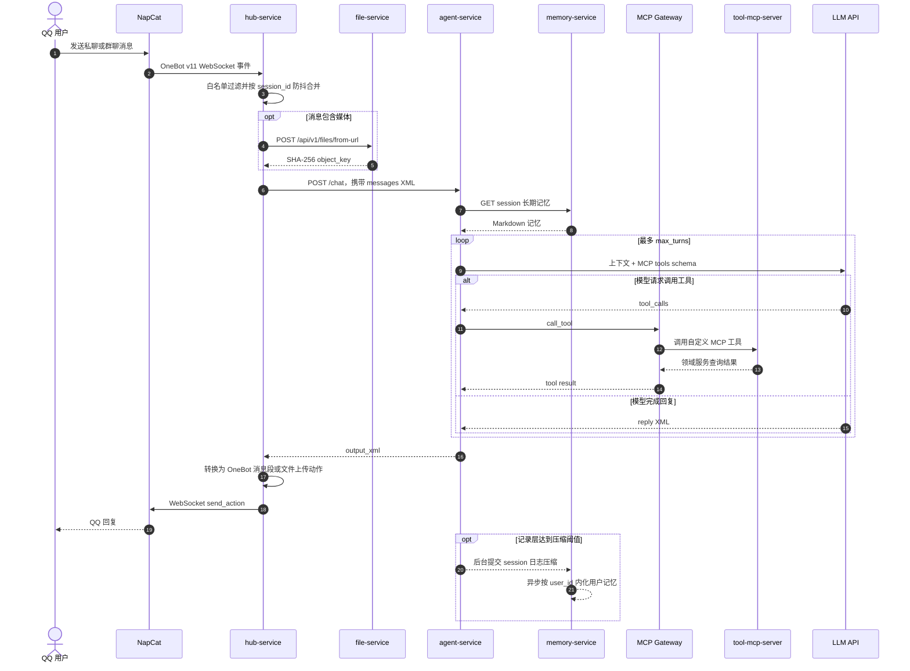

# aichan

## 1. 系统定位

AICHAN 是一个基于 NapCat + OneBot v11 接入的 QQ 私聊/群聊助理系统：NapCat 接入 QQ 消息 → `hub-service` 做会话白名单、XML 转换、会话编排与 QQ 动作出口 → `agent-service` LLM 推理 → 回复回 QQ。

会话状态不依赖 Redis 等队列中间件，服务间直接通过 HTTP + WebSocket 通信；文件真身由 `file-service` 统一用 SHA-256 写入私有 MinIO，业务元数据写入 SQLite；长期记忆由 `memory-service` 写入 markdown 文件，其中 session 级无损日志供 agent 注入，user 级内化记忆通过 MCP 工具按需检索。

## 2. 架构总览


```mermaid
flowchart TB
    subgraph access[QQ 接入层]
        user([QQ 用户]) <--> napcat[NapCat<br/>OneBot v11]
        napcat <-->|反向 WebSocket<br/>事件与动作| hub[hub-service<br/>白名单・防抖・XML 转换]
    end

    subgraph reasoning[推理与工具层]
        hub -->|POST /sessions・/chat・/queue-message| agent[agent-service<br/>会话上下文・Agent Loop]
        agent -->|Chat Completions| llm[主 LLM API]
        agent -->|MCP SSE| gateway[MCP Gateway]
        gateway -->|Streamable HTTP| tools[tool-mcp-server]
    end

    subgraph domain[领域服务层]
        files[file-service<br/>文件存储边界]
        memory[memory-service<br/>长期记忆边界]
    end

    hub -->|媒体入库 / 出站读取| files
    agent -->|session 记忆读取 / 压缩| memory
    tools -->|QQ 信息查询| hub
    tools -->|文件读取 / 媒体理解| files
    tools -->|user 记忆读取| memory

    subgraph persistence[持久化层]
        minio[(MinIO<br/>文件真身)]
        sqlite[(SQLite<br/>文件元数据)]
        markdown[(Markdown Volume<br/>session / user 记忆)]
    end

    files --> minio
    files --> sqlite
    memory --> markdown
```

图中实线代表运行时调用。`memory-service` 自身提供 HTTP 领域接口；`memory_get_user_memory` MCP 工具由 `tool-mcp-server` 包装后经 MCP Gateway 暴露给 agent。

| 服务 | 职责 | 端口 |
|------|------|------|
| `napcat` | OneBot v11 QQ 客户端，收发消息 | 6099 (WebUI) |
| `tool-mcp-server` | 将 QQ 查询、文本文件读取、图片/视频理解、用户记忆检索包装为 MCP 工具 | 8030（内部） |
| `hub-service` | 会话编排中枢：私聊/群聊白名单、防抖合并、XML 转换、调用 agent、统一持有 NapCat WS | 8020 |
| `agent-service` | LLM 推理执行：多轮对话、MCP 工具调用、AICHAN XML 回复生成 | 8000 |
| `memory-service` | 双层长期记忆：按 session_id 保存无损压缩日志，按 user_id 异步内化用户画像与相关记忆 | 8050 |
| `file-service` | 文件存储边界：SHA-256 MinIO 真身 + SQLite 影子元数据 | 8040 |
| `mcp-gateway` | MCP 工具网关，聚合 Tavily、time 与项目自定义工具 | 9000 |
| `minio` | 私有对象存储，只保存 SHA-256 文件真身 | 9000/9001 |

## 3. 消息数据流


```mermaid
sequenceDiagram
    autonumber
    actor U as QQ 用户
    participant N as NapCat
    participant H as hub-service
    participant F as file-service
    participant A as agent-service
    participant M as memory-service
    participant G as MCP Gateway
    participant T as tool-mcp-server
    participant L as LLM API

    U->>N: 发送私聊或群聊消息
    N->>H: OneBot v11 WebSocket 事件
    H->>H: 白名单过滤并按 session_id 防抖合并
    opt 消息包含媒体
        H->>F: POST /api/v1/files/from-url
        F-->>H: SHA-256 object_key
    end
    H->>A: POST /chat，携带 messages XML
    A->>M: GET session 长期记忆
    M-->>A: Markdown 记忆
    loop 最多 max_turns
        A->>L: 上下文 + MCP tools schema
        alt 模型请求调用工具
            L-->>A: tool_calls
            A->>G: call_tool
            G->>T: 调用自定义 MCP 工具
            T-->>G: 领域服务查询结果
            G-->>A: tool result
        else 模型完成回复
            L-->>A: reply XML
        end
    end
    A-->>H: output_xml
    H->>H: 转换为 OneBot 消息段或文件上传动作
    H->>N: WebSocket send_action
    N-->>U: QQ 回复
    opt 记录层达到压缩阈值
        A-->>M: 后台提交 session 日志压缩
        M-->>M: 异步按 user_id 内化用户记忆
    end
```

运行中同一会话出现新消息时，hub 不等待上一轮完成，而是调用 agent 的 `/sessions/{session_id}/queue-message`；agent 在 turn 边界吸收新输入，并放弃尚未发送的旧回复。

## 4. 接口契约

| 服务 | 端点 | 说明 |
|------|------|------|
| `agent-service` | `GET /healthz` | 存活探针 |
| `agent-service` | `POST /sessions` | 创建会话 |
| `agent-service` | `DELETE /sessions/{id}` | 删除会话 |
| `agent-service` | `POST /chat` | 发送 `<messages>`，返回 `<reply>` |
| `memory-service` | `GET /api/v1/memories/{id}` | 读取会话 markdown 记忆 |
| `memory-service` | `POST /api/v1/memories/{id}/compress` | 压缩并追加会话记忆 |
| `memory-service` | `GET /api/v1/users/{id}/memory` | 读取用户级内化长期记忆 |
| `hub-service` | `GET /healthz` | 存活探针 |
| `hub-service` | `GET /api/v1/user/{id}/info` | QQ 用户信息查询，供 MCP 工具调用 |
| `hub-service` | `GET /api/v1/message/history` | QQ 历史消息查询，供 MCP 工具调用 |
| `file-service` | `POST /api/v1/files/from-url` | 从临时 URL 入库并返回 SHA-256 object_key |
| `file-service` | `GET /api/v1/files/{object_key}/metadata` | 文件元数据，供 MCP 工具调用 |
| `file-service` | `GET /api/v1/files/{object_key}/content` | 原始文件 bytes，供图片/视频理解工具调用 |
| `file-service` | `GET /api/v1/files/{object_key}/text` | 文本类文件读取，非文本返回 422 |

### `/chat` 请求/响应格式

请求：
```json
{"session_id": "private_123", "input_xml": "<messages>...</messages>"}
```

响应：
```json
{"output_xml": "<reply><text>笨蛋，找我有什么事喵？</text></reply>"}
```

hub-service 将 `output_xml` 转为 OneBot v11 消息段并发送给当前会话对应的私聊用户或群聊窗口；群聊 `<message target_user_id="..." at="true">` 会在发送时 @ 对应成员。

## 5. 配置

每个服务读取各自目录下的 `config.yml`；Docker Compose 额外读取根目录 `.env`，用于覆盖 agent 模型/密钥、memory 压缩模型/密钥、MinIO 账号、file-service storage 凭证和 tool vision 的 key/base_url/model。

提交到仓库的密钥字段只保留占位值。首次启动前需要在本地 `.env` 填写 `AGENT__MODEL`、OpenAI 兼容 API Key、Langfuse Key、可选的 `VISION__...`，以及在 `napcat/config/webui.json` 填写 WebUI token；如果这些值曾经进入仓库，需要先在对应平台轮换。

| 服务 | 配置文件 |
|------|----------|
| `agent-service` | `agent-service/config.yml` |
| `memory-service` | `memory-service/config.yml` |
| `file-service` | `file-service/config.yml` |
| `hub-service` | `hub-service/config.yml` |
| `tool-mcp-server` | `tool-mcp-server/config.yml` |
| `napcat` | `napcat/config/napcat.json` / `onebot11.json` / `webui.json` |

## 6. 快速开始

```bash
# 启动全套服务
docker compose up -d --build

# 扫码登录 QQ
# 打开 http://localhost:6099/webui，口令见 napcat/config/webui.json

# 验证日志
docker compose logs -f hub-service agent-service memory-service file-service
```

宿主机访问端口避开 Windows 保留端口：`agent-service` 发布到 `18000`，`hub-service` 发布到 `18020`，`file-service` 发布到 `18040`，`memory-service` 发布到 `18050`。容器内部仍使用原始端口 `8000` / `8020` / `8040` / `8050`，服务间配置无需改动。

## 7. 故障语义

| 故障 | 影响 |
|------|------|
| NapCat 断开 | 消息无法收发 |
| hub-service 故障 | 事件无法调度，回复无法发送 |
| agent-service 故障 | 无法生成回复，hub 返回 500 |
| memory-service 故障 | agent 不注入长期记忆；压缩失败时不裁剪历史，不阻断聊天 |
| file-service 故障 | 新媒体无法入库，已有 object_key 媒体无法读取或转发 |
| MCP Gateway 故障 | agent 工具调用失败，但不影响不依赖工具的回复 |
| LLM API 故障（401/超时等） | agent 立即返回错误（60s 超时，0 重试） |

## 8. 设计权衡

- 会话状态在 `agent-service` 和 `hub-service` 的进程内存中，重启丢失，单实例部署
- session 无损日志在 `memory-service` markdown volume 中持久化并持续追加；user 级记忆允许内化、去重和分类
- 防抖窗口内合并消息，减少 LLM 调用次数
- NapCat 只有一条反向 WS 连接，由 `hub-service` 统一持有，避免收发链路和工具查询链路各自维护连接
- OneBot v11 复杂性收口在 `hub-service`，agent 只处理 AICHAN XML
- 文件物理存储与业务元数据收口在 `file-service`，hub/agent/tool 均不直接连接 MinIO
- 错误只在最外层（router）记录，内层直接抛出
- 可观测性通过 Langfuse 上报，覆盖 LLM generation 和工具调用
