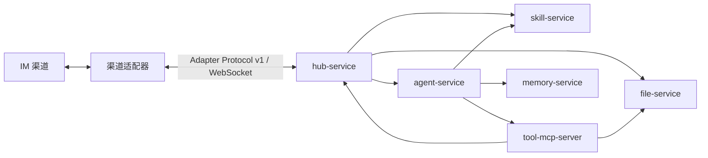

# AICHAN 系统总览

## 架构

AICHAN 的核心服务不感知具体 IM 渠道。渠道适配器负责接入、过滤、标准 XML 转换、媒体导入和最终投递；hub-service 负责适配器连接、会话防抖、串行调度及 agent 调用。


```mermaid
flowchart LR
    IM[IM 渠道] <--> adapter[渠道适配器]
    adapter <-->|Adapter Protocol v1 / WebSocket| hub[hub-service]
    hub --> agent[agent-service]
    hub --> files[file-service]
    hub --> skills[skill-service]
    agent --> skills
    agent --> mcp[tool-mcp-server]
    mcp --> hub
    mcp --> files
    agent --> memory[memory-service]
```

渠道适配器是独立部署单元，通过 Adapter Protocol v1 主动连接 hub，可作为独立仓库/独立 Compose 运行，与核心服务只共享一张外部网络。核心服务不感知具体渠道实现。QQ/NapCat 适配器是首个实现，位于 `adapters/aichan-qq-adapter/`。

## 服务

| 服务 | 端口 | 职责 |
|---|---:|---|
| agent-service | 8000 / 18000 | LLM 推理与会话上下文 |
| hub-service | 8020 / 18020 | 适配器注册、会话编排、能力路由 |
| tool-mcp-server | 8030 | 通用适配器、文件、视觉和记忆工具 |
| file-service | 8040 / 18040 | 媒体对象存储 |
| memory-service | 8050 / 18050 | 长期记忆 |
| skill-service | 8060 / 18060 | runtime skill 注册与解析 |

## 启动

核心服务与渠道适配器分属独立的 Compose（适配器可以是独立仓库），共享一张由核心 Compose 创建、适配器以 `external` 引用的网络（`aichan-adapter-network`）。**必须先启动核心服务，再启动适配器**——否则适配器会因网络不存在而无法创建。

第一步，在仓库根启动核心服务（同时创建共享网络）：

```bash
docker compose up -d
```

第二步，按各适配器自身文档启动其 Compose。适配器经 `external` 网络接入 hub，并以 token 完成注册鉴权。

适配器鉴权约定：核心侧在 `.env` 的 `HUB__ADAPTER_TOKENS` 中为 `<adapter_id>:<instance_id>` 配置令牌，适配器侧配置同一令牌值。仓库自带的 QQ/NapCat 适配器见 [adapters/aichan-qq-adapter/](../adapters/aichan-qq-adapter/)。

当前所有会话、ACK 去重和适配器连接状态均为进程内状态；重启后不补发未确认事件。
