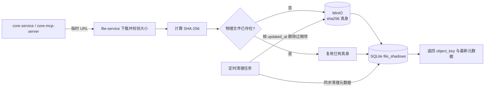
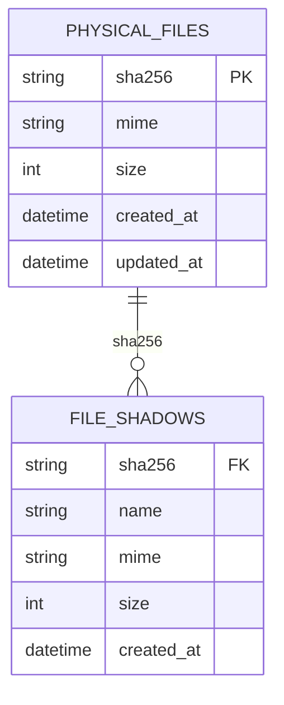

# file-service

## 1. 模块定位

`file-service` 是 AICHAN 的唯一文件存储边界。它负责从临时 URL 下载文件、计算 SHA-256、把文件真身写入 MinIO，并把文件名、MIME、大小等业务影子元数据写入 SQLite。

文件默认保留 7 天。过期判断基于物理文件的 `updated_at` 与 `storage.expire_after_seconds`，过期后 metadata/content/text 读取统一按文件不存在返回 404。服务启动后会按 `storage.cleanup_interval_seconds` 定时批量删除过期 MinIO 真身和 SQLite 元数据。

物理对象键固定为文件内容的 SHA-256：

```text
<sha256>
```

不再按 QQ、会话、消息、来源或扩展名拆分对象路径。同一内容重复出现时，MinIO 只保留一份真身，SQLite 追加新的影子元数据。



## 2. 接口契约

除 URL 入库外，`POST /api/v1/files` 接受 multipart 字段 `upload`，供 hub 的标准适配器文件 API 代理上传。响应与 URL 入库相同，返回 SHA-256 object_key 和元数据。

- `GET /healthz`
  - 响应：`{"status":"ok"}`
- `POST /api/v1/files/from-url`
  - 请求：
    ```json
    {
      "url": "https://example.test/file",
      "name": "note.txt",
      "mime": "text/plain",
      "kind": "file"
    }
    ```
  - `name/mime/kind` 可为空；服务会根据响应头、文件名、URL 后缀和媒体类型回推 MIME
  - 响应：
    ```json
    {
      "ok": true,
      "data": {
        "object_key": "xxx",
        "name": "note.txt",
        "mime": "text/plain",
        "size": 5,
        "sha256": "xxx"
      }
    }
    ```
- `GET /api/v1/files/{object_key}/metadata`
  - 返回未过期文件的最新影子元数据；`object_key` 必须是 64 位小写 SHA-256
- `GET /api/v1/files/{object_key}/content`
  - 返回原始 bytes，`Content-Type` 使用 SQLite 中记录的 MIME
- `GET /api/v1/files/{object_key}/text?max_chars=12000`
  - 仅支持 `text/*` 或常见文本扩展名；非文本返回 422

## 3. 存储模型



MinIO：
- bucket：`storage.bucket`
- object key：`sha256`
- object metadata：只保存 `sha256/size` 等物理属性

SQLite：
- `physical_files`
  - `sha256`：主键
  - `mime/size/created_at/updated_at`
- `file_shadows`
  - `sha256/name/mime/size/created_at`
  - 同一个 `sha256` 可以有多条影子记录

读取 metadata 时，服务取该 SHA 最新影子作为展示名。这样文件名等业务信息不会污染物理对象路径，也不会阻止内容去重。

## 4. 配置项

| 配置项 | 类型 | 说明 |
|--------|------|------|
| `server.host` | str | 监听地址 |
| `server.port` | int | 监听端口 |
| `server.log_level` | str | 日志级别 |
| `storage.endpoint` | str | MinIO S3 endpoint，compose 默认 `minio:9000` |
| `storage.bucket` | str | 文件 bucket，默认 `aichan-files` |
| `storage.access_key` | str | MinIO access key；compose 用 `STORAGE__ACCESS_KEY` 注入 |
| `storage.secret_key` | str | MinIO secret key；compose 用 `STORAGE__SECRET_KEY` 注入 |
| `storage.secure` | bool | 是否使用 HTTPS |
| `storage.database_path` | str | SQLite 文件路径，compose 默认挂载到 `/data/file-service.sqlite3` |
| `storage.download_timeout_seconds` | float | 下载临时 URL 的超时秒数 |
| `storage.max_object_bytes` | int | 单个文件最大字节数 |
| `storage.expire_after_seconds` | int | 文件读取有效期，默认 604800 秒（7 天） |
| `storage.cleanup_interval_seconds` | float | 过期文件自动清理间隔，默认 3600 秒 |
| `storage.cleanup_batch_size` | int | 每轮最多清理的过期文件数，默认 100 |

配置加载由 `pydantic-settings` 统一处理，优先级为：显式初始化参数 > 环境变量 > 根目录 `.env` > `file-service/config.yml`。MinIO 根账号仍由根目录 `.env` 的 `MINIO_ROOT_USER` / `MINIO_ROOT_PASSWORD` 管理，compose 再注入为 file-service 的 `STORAGE__ACCESS_KEY` / `STORAGE__SECRET_KEY`。

## 5. 启动方式

Docker Compose 会启动 `file-service`，并挂载：

- `./file-service/config.yml:/app/file-service/config.yml:ro`
- `file-service-data:/data`

服务默认只在 Compose 网络内通过 `http://file-service:8040` 访问，不暴露宿主机端口。
