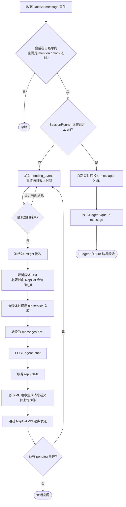

# hub-service

## 1. 模块定位

`hub-service` 是 QQ 会话编排中枢：通过唯一的 NapCat WebSocket 接收 OneBot v11 私聊/群聊事件，按规范化 `session_id` 做白名单过滤、防抖合并与串行调度，调用 `agent-service` 生成 XML 回复，再通过同一条 NapCat WS 发送 QQ 消息。

文件真身和文件元数据不属于 hub-service。NapCat 媒体 URL 会交给 `file-service` 入库，hub-service 只在 `<messages>` 和 `<reply>` 流程中传递 SHA-256 `object_key`。

## 2. 接口契约

### 2.1 对外提供（HTTP）

- `GET /healthz`
  - 响应：`{"status":"ok"}`
- `GET /api/v1/user/{user_id}/info`
  - 通过 NapCat `get_stranger_info` 动作查询用户信息
- `GET /api/v1/message/history?message_type=private|group&peer_id=...`
  - 通过 NapCat 历史消息动作查询私聊或群聊记录，供 MCP 工具调用

hub-service 不再提供 `/api/v1/files/...` 文件读取接口；文件元数据、内容和文本读取统一由 `file-service` 提供。

### 2.2 对外消费（WebSocket）

- 连接 NapCat 反向 WS，接收 OneBot v11 事件
- 固定只处理 `post_type=message` 且 `message_type=private|group`
- 会话必须存在于 `hub.session_whitelist`
- 群聊可通过 `require_mention` 要求只有 @ 机器人时才触发
- `blocked_user_ids` 中的群成员或私聊用户会被忽略
- 白名单为空时全部忽略，不创建会话

### 2.3 对外消费（HTTP）

- `POST {agent_url}/sessions` — 创建 agent 会话，请求携带规范化 `session_id` 和 metadata
- `POST {agent_url}/chat` — 发送 `<messages>` XML，接收 `<reply>` XML
- `POST {agent_url}/sessions/{session_id}/queue-message` — 同一会话运行中收到新消息时追加到 agent 会话队列
- `POST {file_service.base_url}/api/v1/files/from-url` — 把 NapCat 临时 URL 交给 file-service 入库
- `GET {file_service.base_url}/api/v1/files/{object_key}/metadata|content` — 发送出站 object_key 媒体时读取元数据和 bytes

### 2.4 对外产出（WebSocket → NapCat）

- 通过 NapCat WS `send_action` 发送 `send_private_msg` 或 `send_group_msg`
- `<reply>` 下每个 `<message>` 组装成一条 QQ 消息，按 XML 顺序逐条发送
- 群聊在 `<message>` 上加 `target_user_id="..." at="true"`，让 hub 在消息前插入 @ 段
- `<message>` 内的 `<text>`、`<face>` 和媒体节点按顺序合并为同一条 OneBot message segment 列表；`<face name="..." />` 会按 hub 内置 QQ 表情表翻译为 NapCat/OneBot `face.id`
- `<image object_key="..." />`、`<record object_key="..." />`、`<video object_key="..." />` 会从 file-service 读取 bytes，转换为 NapCat/OneBot v11 支持的 `base64://...` 后发送
- `<file object_key="..." />` 会从 file-service 读取 bytes，并在原 XML 位置通过 NapCat `upload_private_file` 或 `upload_group_file` 发送文件
- `auto_escape` 固定为 `false`

## 3. 核心数据模型

### 3.1 会话键（`session_id`）

- 私聊：`private_<user_id>`
- 群聊：`group_<group_id>`
- 作为 hub-service runner、agent-service session、上下文、队列和记忆读取的唯一定位符

### 3.2 SessionRegistry

- `session_id → SessionRunner` 映射
- `session_id → agent_session_id` 映射
- 首次看到白名单内会话：调用 `/sessions` 创建 agent 会话，再创建 runner

创建 agent 会话时传入：

```json
{
  "session_id": "group_20001",
  "platform": "qq",
  "session_type": "group",
  "group_id": 20001,
  "self_id": 10001
}
```

### 3.3 媒体入库

- `MediaStorage.store_segment()` 是 hub 内部的 file-service HTTP 适配器，不直接连接 MinIO
- 带 `url` 的 `image/file/record/video` segment 会提交到 `POST /api/v1/files/from-url`
- `NapcatFileResolver`：当 `file` segment 没有 `url` 但带有 `file_id/file/id` 时，通过 NapCat `get_private_file_url` / `get_file` 尝试换取下载 URL，再交给 file-service 入库
- `object_key` 固定为文件 SHA-256，hub 不再把来源、会话、消息 ID 或扩展名写入物理键
- `<messages>` 中只暴露 `object_key` 和 `name`，不暴露 NapCat 原始 URL
- 无法换取下载 URL 的 `file` 输出 `<unsupported type="file" name="..." />`，保留文件名等安全元信息，避免 agent 完全丢失“用户发过文件”的语义

### 3.4 XML 转换

- `onebot_events_to_input_xml(events, media_storage)`：把防抖批次转换为 `<messages>`，需要 I/O 时会先完成媒体入库
- `reply_xml_to_onebot_segments(xml, media_storage)`：把 `<message>` 内容转换为 OneBot v11 消息段列表；出站图片/语音/视频 `object_key` 会在这里解析为 `base64://...`，`<text>` 和 `<face>` 按顺序合并为同一条 segment 列表
- `reply_xml_to_file_uploads(xml, media_storage)`：把 `<file object_key="..." />` 转为 NapCat `upload_private_file` 参数
- `reply_xml_to_outbound_items(xml, media_storage)`：按 `<reply>` 下 `<message>` 顺序生成出站动作项，每个 `<message>` 对应一条发送
- 转换层保留每条消息的 `user_id/nickname/at_bot`，丢弃 `raw_message`、`font` 和无关 sender 字段
- 普通 QQ `face` 段在 NapCat/OneBot 中只有 `id`；hub 会按内置表转换为 `<face name="微笑" />`，无法识别的 ID 会降级为 `<unsupported type="face" />`。商城表情 `mface` 会保留 `summary`，例如 `<mface emoji_package_id="..." emoji_id="..." summary="..." />`

## 4. 防抖调度流程



关键规则：
- 非运行状态下，消息仍由 hub 的防抖窗口合并为一个 `<messages>` 后调用 `/chat`
- 正在运行时，同一会话新消息不进入 hub 的下一轮 pending 队列，而是立即调用 `/queue-message` 交给 agent 会话内部队列
- hub 不再发送空 `<messages />` 触发补跑；运行中新消息是否覆盖旧回复由 agent-service 的 turn-loop 和 queued message drain 逻辑统一收口

## 5. 配置项

| 配置项 | 类型 | 说明 |
|--------|------|------|
| `server.host` | str | 监听地址 |
| `server.port` | int | 监听端口 |
| `server.log_level` | str | 日志级别 |
| `hub.agent_url` | str | agent-service 地址 |
| `hub.debounce_seconds` | float | 防抖窗口（秒） |
| `hub.session_whitelist` | list[object] | 允许对话的会话列表，按 `type` 和 `id` 配置，可含 `require_mention`、`blocked_user_ids` |
| `napcat.ws_action_timeout_seconds` | int | NapCat 动作超时（秒） |
| `file_service.base_url` | str | file-service HTTP API 地址，compose 默认 `http://file-service:8040` |
| `file_service.timeout_seconds` | float | 调用 file-service 的超时秒数 |

配置加载由 `pydantic-settings` 统一处理，优先级为：显式初始化参数 > 环境变量 > 根目录 `.env` > `hub-service/config.yml`。hub-service 不再读取 MinIO 凭证，也不再接受 `STORAGE__...` 覆盖项。

白名单示例：

```yaml
hub:
  session_whitelist:
    - type: private
      id: 2041214551
      enabled: true
    - type: group
      id: 1019750164
      enabled: true
      require_mention: true
      blocked_user_ids: []
```

## 6. 设计权衡

- 会话状态全内存：不支持多副本和重启恢复
- 入口支持 QQ 私聊和群聊；群聊默认建议启用 `require_mention`
- 下游 agent HTTP `timeout=None`：避免误超时，但缺少硬超时保护
- 高频连发若持续未达静默窗口，会延后触发 agent
- NapCat WS 是单连接内存状态，当前部署目标是单实例
- 文件读取和物理去重属于 file-service，hub 只保留最薄的 HTTP 适配层
