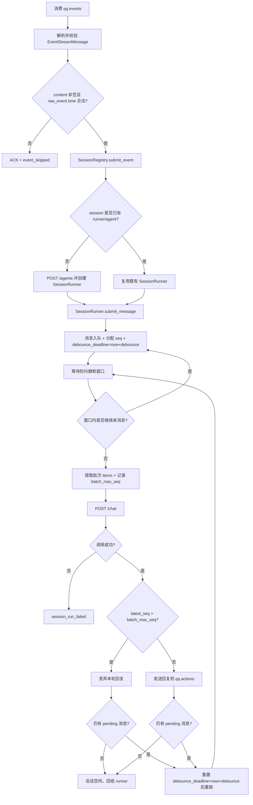
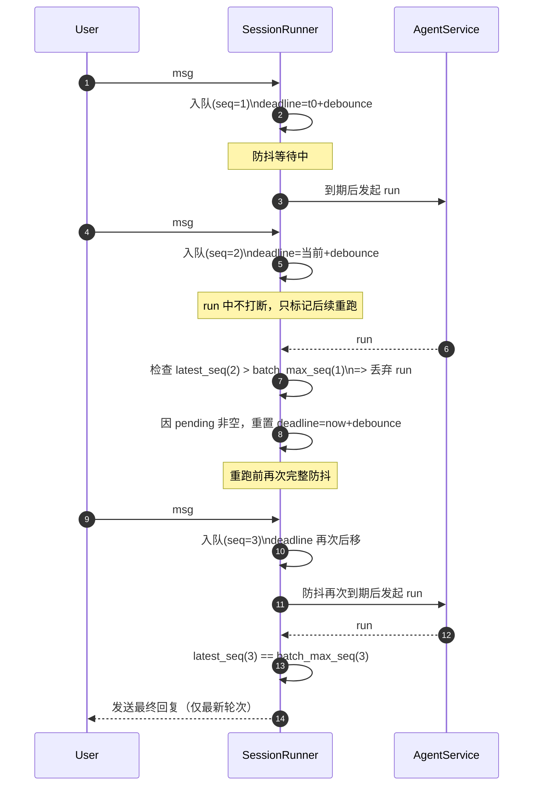

# hub-service

## 1. 模块一句话定位
`hub-service` 是会话编排中枢：从 `qq.events` 消费事件，做最小保底校验后按 `session_id` 进入防抖与串行调度，调用 `agent-service` 生成回复，再写回 `qq.actions`。  
不负责 QQ 协议接入与消息发送执行（发送由 `adapter-service` 完成）。

## 2. 接口契约
### 2.1 对外提供（HTTP）
- `GET /healthz`
  - 响应：`{"status":"ok"}`
  - 语义：仅表示进程存活。

### 2.2 对外消费（HTTP）
- `POST {hub.agent_url}/agents`
  - 请求体（`AgentCreateRequest`）：
    - `metadata: dict[str, Any]`（hub 当前最小传入 `{"session_id": "<session_id>"}`）
  - 响应体（`AgentCreateResponse`）：
    - `agent_id: str`
    - `metadata: dict[str, Any]`

- `POST {hub.agent_url}/chat`
  - 请求体（`AgentChatRequest`）：
    - `agent_id: str`
    - `messages: list[AgentInboundMessage]`（最少 1 条）
    - `message_mode: "start" | "append"`（首轮为 `start`，同一回复链路重跑为 `append`）
    - `AgentInboundMessage` 固定字段：
      - `user_id: str`
      - `event_time: str`
      - `content: str`
  - 成功响应体（`AgentChatResponse`）：
    - `reply: str`
  - 失败语义：
    - 下游 `status_code >= 400`：抛出 `RuntimeError`（包含 `url/status/body`）
    - 下游 JSON 不是对象：抛出 `ValueError`
    - 响应结构不匹配：Pydantic 校验异常

### 2.3 对外消费（Redis Stream）
- 输入流：`redis.events_stream`（默认 `qq.events`）
- 读取方式：`XREADGROUP`（group=`redis.events_group`，consumer=`redis.events_consumer`）
- 消息字段（`EventStreamMessage`）：
  - `event_id`、`session_id`、`user_id`、`content`、`source`、`message_type`、`raw_event`、`created_at`
- 消费规则：
  - `content` 去空白后为空：ACK + `hub.event_skipped(reason=empty_content)`
  - `raw_event.time` 缺失或不可解析：ACK + `hub.event_skipped(reason=missing_event_time)`
  - 合法事件：提交 `SessionRegistry`，成功后 ACK + `hub.event_submitted`
  - 非法结构：`hub.event_dropped` 后 ACK
  - 运行期异常：`hub.event_retry`，不 ACK（保留 PEL 供重试）

### 2.4 对外产出（Redis Stream）
- 输出流：`redis.actions_stream`（默认 `qq.actions`）
- 动作模型（`ActionStreamMessage`）：
  - `action_id: uuid4`
  - `session_id: str`
  - `action_type: "send_message"`
  - `payload: {"content": "<reply>"}`
  - `created_at: ISO8601 UTC`

## 3. 核心数据模型
### 3.1 事件输入模型（`EventStreamMessage`）
- 业务主键：`event_id`
- 会话归并键：`session_id`
- 文本字段：`content`（hub 只做空文本保底）
- 审计上下文：`raw_event`（`event_time` 必须从 `raw_event.time` 提取）

### 3.2 会话运行模型（`SessionRunner`）
- `pending_messages: list[tuple[seq, AgentInboundMessage]]`
- `running: bool`
- `debounce_deadline: float | None`
- `debounce_task: Task | None`
- `reply_cycle_active: bool`
- 语义：
  - 同一 `session_id` 串行
  - 防抖窗口内合并为一个 `messages` 批次
  - 每条消息入队时分配单调递增 `seq`，用于判断“当前回复是否已过时”
  - 若本轮回复因新消息被判定过时，重跑前会重新等待一次完整 `debounce_seconds`；等待期间有新消息会继续重置计时
  - 回复链路内首次调用 agent 使用 `message_mode=start`，若因新消息导致重跑则使用 `message_mode=append`

### 3.3 会话注册表（`SessionRegistry`）
- `session_id -> SessionRunner`（活跃 runner 映射）
- `session_id -> agent_id`（内存常驻映射，当前版本不回收）
- 首次看到新 `session_id`：
  - 先调用 `/agents` 创建 `agent_id`
  - 再创建 runner
- 后续同会话复用同一 `agent_id`

## 4. 连发处理与防抖流程
### 4.1 全链路总览（事件 -> 防抖 -> 重跑/发送）

### 4.2 SessionRunner 状态机（单会话）
- `pending_messages`：当前会话待处理消息队列（每条消息附带单调递增 `seq`）。
- `running`：是否正在执行一轮 agent 调用。
- `debounce_deadline`：下一次允许启动运行的最早时间点。
- `reply_cycle_active`：是否处于同一回复链路中（决定 `message_mode=start/append`）。

状态切换规则：
- 收到消息时：
  - 追加到 `pending_messages`。
  - `latest_seq` 更新为当前消息的 `seq`。
  - `debounce_deadline` 总是刷新为 `now + debounce_seconds`。
  - 若当前 `running=True`，只更新队列和截止时间，不会打断当前 agent 调用。
- 防抖到期且可运行时：
  - 复制 `pending_messages` 形成本轮批次并清空队列。
  - 设置 `running=True` 后调用 agent。
- 运行完成后的发送决策：
  - 若 `latest_seq > batch_max_seq`：说明运行期间来了新消息，本轮回复过时，直接丢弃。
  - 否则发送本轮回复。
- 需要重跑时：
  - 只要 `pending_messages` 非空，都会重置 `debounce_deadline=now+debounce_seconds`。
  - 这保证“每次重跑前都要重新走完整防抖窗口”，窗口内有新消息会继续重置计时。

### 4.3 连发场景时序图（含重跑前再次防抖）

### 4.4 关键判定点
- `latest_seq > batch_max_seq` 的含义：
  - 本轮请求发送给 agent 的输入批次已经“落后于当前最新消息”，回复必须丢弃。
- `mode=start` 与 `mode=append`：
  - `start`：当前回复链路的首轮调用。
  - `append`：同一回复链路内，因新消息触发的重跑轮次。
- 丢弃策略边界：
  - 不取消进行中的 agent 调用。
  - 只在调用返回后做“发送/丢弃”决策。

## 5. 配置项与运行依赖
### 5.1 配置文件
- 路径：`hub-service/config.yml`
- 加载方式：仅 YAML，`extra="forbid"` 严格校验。

### 5.2 配置项（当前代码）
- `server.host`、`server.port`、`server.log_level`
- `hub.agent_url`、`hub.debounce_seconds`
- `redis.host`、`redis.port`、`redis.db`、`redis.password`
- `redis.events_stream`、`redis.events_group`、`redis.events_consumer`、`redis.events_block_ms`
- `redis.actions_stream`

### 5.3 运行依赖
- Redis（Stream + Consumer Group）
- `agent-service`（`/agents` + `/chat`）
- FastAPI / uvicorn / httpx / redis-py asyncio

## 6. 非功能性设计
### 6.1 错误处理
- 脏数据 ACK 丢弃，避免卡消费游标。
- 运行期异常不 ACK，依赖 PEL 做至少一次重试。
- 下游 HTTP 非 2xx 保留响应体，提升排障可见性。

### 6.2 日志
- 统一前缀：`hub_service.*`
- 关键事件：`event_skipped`、`event_submitted`、`session_run_started/completed/failed`、`session_reply_discarded`、`downstream_called`
- 会话调度日志核心字段：`session_id`、`agent_id`、`message_count`

## 7. 设计权衡与已知不足
- `session -> agent` 映射当前仅内存常驻，不做 TTL / 回收。
- 状态内存化不支持跨实例共享与重启恢复。
- 下游调用 `timeout=None`，避免误超时但缺少硬超时保护。
- 当用户持续高频连发且始终未达到防抖静默窗口时，会延后触发 agent 生成。

