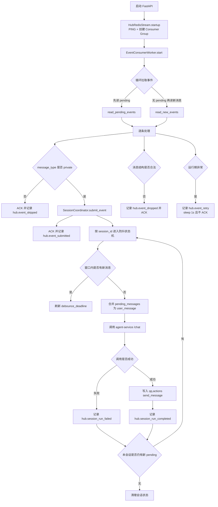

# hub-service

## 1. 模块一句话定位
`hub-service` 是会话编排中枢：从 `qq.events` 消费消息事件，按 `session_id` 做防抖与串行调度，调用 `agent-service` 生成回复，并把回复写入 `qq.actions`。  
不负责 QQ 协议接入、不负责消息发送落地（发送由 `adapter-service` 执行）。

## 2. 接口契约
### 2.1 对外提供（HTTP）
- `GET /healthz`
  - 响应：`{"status":"ok"}`
  - 语义：进程存活探针，不代表下游依赖全部健康。

### 2.2 对外消费（HTTP）
- 目标：`{hub.agent_url}/chat`
- 方法：`POST`
- 请求体（`AgentChatRequest`）：
  - `session_id: str`（最小长度 1）
  - `user_message: str`（最小长度 1）
- 成功响应体（`AgentChatResponse`）：
  - `reply: str`
- 失败语义：
  - 下游 `status_code >= 400`：抛出 `RuntimeError`，错误文本包含 `url/status/body`。
  - 下游 JSON 不是对象：抛出 `ValueError`。
  - 下游响应结构不匹配：Pydantic 校验异常。

### 2.3 对外消费（Redis Stream）
- 输入流：`redis.events_stream`（默认 `qq.events`）
- 读取方式：`XREADGROUP`（group=`redis.events_group`，consumer=`redis.events_consumer`）
- 消息字段（`EventStreamMessage`）：
  - `event_id`、`session_id`、`user_id`、`content`、`source`、`message_type`、`raw_event`、`created_at`
- 消费规则：
  - `message_type != private`：直接 ACK 并跳过（当前仅处理私聊）。
  - 非法消息（字段不合法）：记录 `hub.event_dropped`，ACK 丢弃。
  - 运行期异常：记录 `hub.event_retry`，不 ACK（保留在 PEL，后续重试）。

### 2.4 对外产出（Redis Stream）
- 输出流：`redis.actions_stream`（默认 `qq.actions`）
- 动作模型（`ActionStreamMessage`）：
  - `action_id: uuid4`
  - `session_id: str`
  - `action_type: "send_message"`
  - `payload: {"content": "<reply>"}`
  - `created_at: ISO8601 UTC`

### 2.5 异常码说明
- 本模块没有自定义业务异常码体系。
- 对外 HTTP 仅暴露 `healthz`，业务失败通过内部日志与重试机制处理。

## 3. 核心数据模型
### 3.1 事件输入模型（`EventStreamMessage`）
- 业务主键：`event_id`
- 会话归并键：`session_id`
- 决策字段：`message_type`（`private/group`，决定是否进入调度）
- 审计上下文：`raw_event`（保留源事件原始信息）

### 3.2 会话状态模型（`SessionState`，内存态）
- `running: bool`：当前会话是否在执行一轮 agent 调用。
- `pending_messages: list[str]`：等待被合并的消息队列。
- `debounce_deadline: float | None`：防抖截止时间（事件循环时钟）。
- `debounce_task: Task | None`：当前会话的防抖任务句柄。

### 3.3 动作输出模型（`ActionStreamMessage`）
- `action_type` 当前固定 `send_message`，表示 hub 只产出“回复动作”，不承担更复杂动作编排。

## 4. 核心业务流程

## 5. 配置项与运行依赖
### 5.1 配置文件
- 路径：`hub-service/config.yml`
- 加载方式：仅加载该 YAML 文件，不读取 `.env`。
- 校验策略：Pydantic `extra="forbid"`，未知字段/缺失字段/类型错误都会启动失败。

### 5.2 配置项（当前代码可见）
- `server.host`、`server.port`、`server.log_level`
- `hub.agent_url`、`hub.debounce_seconds`
- `redis.host`、`redis.port`、`redis.db`、`redis.password`
- `redis.events_stream`、`redis.events_group`、`redis.events_consumer`、`redis.events_block_ms`
- `redis.actions_stream`

### 5.3 运行依赖
- Redis（Stream + Consumer Group）
- `agent-service` HTTP 接口 `/chat`
- `fastapi` + `uvicorn` + `httpx` + `redis-py asyncio`

## 6. 非功能性设计
### 6.1 错误处理
- 消费循环采用“最小必要边界”：
  - 脏数据：ACK 丢弃，避免阻塞游标。
  - 运行期异常：不 ACK，依赖 PEL 至少一次重试。
- 下游 HTTP 非 2xx 时保留响应体，提升排障可观测性。

### 6.2 日志
- 统一 logger 前缀：`hub_service.*`
- 框架日志（`uvicorn/httpx/websockets`）被静默，业务日志采用中文摘要 + 关键字段高亮。
- 关键事件覆盖：启动、停止、消费过滤、调度成功/失败、下游调用耗时、动作入队耗时。

### 6.3 性能关键点
- 会话级串行 + 防抖合并：降低短时间多条消息造成的 LLM 调用放大。
- `xreadgroup` 批量读取（每批 20）+ 阻塞读取新消息，减少空轮询压力。
- 状态全在内存，路径短但不具备跨实例共享能力。

## 7. 架构边界与集成点
### 7.1 所在层级
- 业务编排层（Orchestration Layer），位于消息接入与智能体执行之间。

### 7.2 强依赖
- Redis Stream：无 Redis 无法消费事件也无法产出动作。
- `agent-service /chat`：无下游回复能力时仅能记录失败。

### 7.3 弱依赖
- `healthz` 仅用于存活探针，不参与主链路。

### 7.4 故障影响
- `hub-service` 不可用：`qq.events` 堆积，消息无法触发 agent。
- `agent-service` 不可用：事件被消费后无法生成回复，失败只在日志可见。
- `adapter-service` 不可用：`qq.actions` 堆积，回复无法实际发送。

## 8. 设计权衡与已知不足
- 仅处理 `private`，`group` 消息直接 ACK 丢弃：行为清晰，但当前不支持群聊机器人。
- 会话状态内存化：实现简单、低延迟，但多副本下无法共享会话态，存在跨实例顺序不一致风险。
- 失败恢复依赖 PEL 重试，没有显式重试上限/死信队列：可保“至少一次”，但潜在坏消息会长期回放。
- 下游调用 `timeout=None`：避免长响应误超时，但缺少硬超时会放大尾部请求占用。
- 对外无业务诊断接口（仅 `healthz`）：排障主要依赖日志与 Redis 观测。

